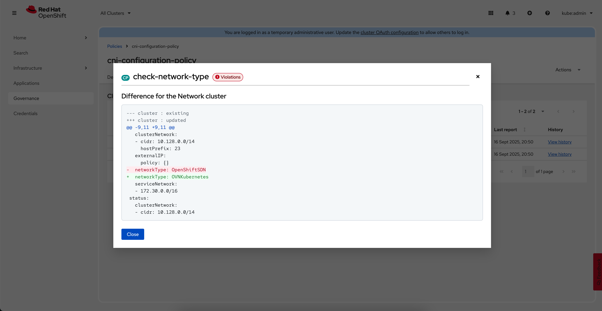

# CNI driver check policy for Red Hat OpenShift Advance Management for Kubernetes

This repository demonstrates how to check population of a OpenShift clusters for CNI driver configured with Red Hat OpenShift Advance Management for Kubernetes using Policy defined.

## Overview

Older version of OpenShift could have OpenShiftSDN CNI driver configured as the one was a default back then. Recent versions, as a default one do have OVNKubernetes.

Evaluating a population of clusters could be troublesome. Thanks to the Policy that you can implement with RHACM that fact can be reported to an operator a simple way as we demonstrate here. 

## Prerequisites

- Access to an OpenShift cluster with cluster-admin privileges.
- install Red Hat Advanced Cluster Management for Kubernetes operator
- configure Red Hat Advanced Cluster Management for Kubernetes at the local cluster
- `oc` or `kubectl` CLI tools installed and configured.

## Quick Start

### 1. Create a required policy

Run this one and only required shell script

```sh
./01-install-cni-configuration-policy.sh
```

you shoud see a new policy named `cni-configuration-policy` created, reporting compliance drifts across your clusters population


In my cane I had one recent version cluster `local-cluster` with CNI driver `OVNKubernetes` and one older with `OpenShiftSDN` as a CNI driver set. Therefore you see one cluster as compliant and the second as not.


if you check 'View driff' for non compliant cluster, you can easily find out why it complains



## Contributing

Contributions and suggestions are welcome! Please open an issue or submit a pull request.

## License

This repository is licensed under the MIT License.


